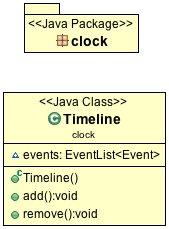
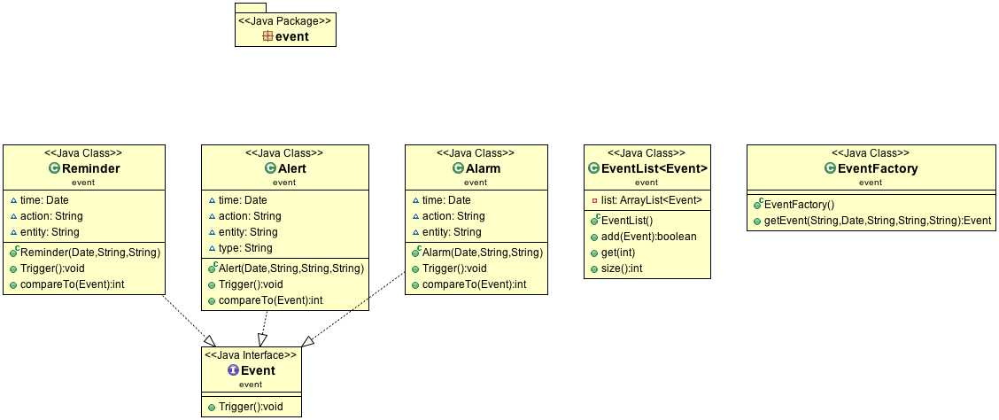
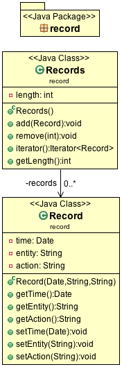
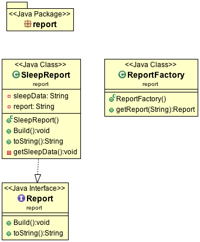

# Documentation
## Usage
## Packages
- [clock](#clock)
  - [Timeline](#Timeline)

- [event](#event)
  - [Event](#Event)
  - [EventFactory](#EventFactory)
  - [EventList](#EventList)
  - [Alarm](#Alarm)
  - [Alert](#Alert)
  - [Reminder](#Reminder)

- [record](#record)
  - [Record](#Record)
  - [Records](#Records)

- [report](#report)
  - [Report](#Report)
  - [ReportFactory](#ReportFactory)
  - [SleepReport](#SleepReport)

## [clock](../src/clock) <a id="clock"></a>
UML: 

### [Timeline](../src/clock/Timeline.java) <a id="Timeline"></a>
`clock.Timeline` is where the clock is initialized, counts, and holds all upcoming events. Think of the `Timeline` as a real timeline, only [events](#event): [`event.Alarm`](#Alarm), [`event.Alert`](#Alert), & [`event.Reminder`](#Reminder) are added to the timeline. After an event is triggered it is removed from the timeline, unless the event has specified to reoccur.

```
Timeline  +  -  |  -  |  -  |  -  |  -  |  -  |  -  |  -  |  -  |  -  |  -  |  -  |  -  |  -  |  -  |  -  |  -  |  -  |  -  |  -  |  -  |  -  |  -  |  -  +
Hour      0     1     2     3     4     5     6     7     8     9     10    11    12    13    14    15    16    17    18    19    20    21    22    23    24
Event                                                   Alarm                                                     Reminder Alert
```

**Supported methods:**
- `add(Event):void`
- `remove(Event):void`

## [event](../src/event) <a id="event"></a>
The event package contains all the events: [`Alarm`](#Alarm), [`Alert`](#Alert), & [`Reminder`](#Reminder); which can be added to [clock.Timeline](#Timeline). To create a new event, create the [EventFactory](#EventFactory) and specify the event you'd like to create.

UML: 

### [Event](../src/event/Event.java) <a id="Event"></a>
This is the interface that is used to create [`Alarm`](#Alarm), [`Alert`](#Alert), & [`Reminder`](#Reminder). Each Event will have a trigger that sends out an `ActionEvent`. This allows your interface to listen to the timeline events. If you're to create your own event it must trigger an `ActionEvent`. The recommended practice is to add your event before it is suppose to be triggered. You may, but not suggested, call the `ActionEvent`'s separate from the event. The action will still be recorded in [`record.Records`](#Records)

**Must implement methods:**
- `trigger():void`
- `compareTo():int`

### [EventFactory](../src/event/EventFactory.java) <a id="EventFactory"></a>
This is where you'll want to create your Events that will be added to [clock.Timeline](#Timeline). You may extend this class to add custom Events that aren't supported by default.

### [EventList](../src/event/EventList.java) <a id="EventList"></a>
This is what the Timeline uses to hold all the Events for the future. It will hold any amount and always sort the events to the closest current time.

### [Alarm](../src/event/Alarm.java) <a id="Alarm"></a>
This is one of three default events, this triggers the `Ring` event. You must pass three parameters into the class: `Date time`, `String action`, & `String entity`.

### [Alert](../src/event/Alert.java) <a id="Alert"></a>
This is the second of three default events, this triggers the `Notify` event and also trigger the `type` of event. The `type` is either `RED` or `YELLOW` (case insensitive). You must pass four parameters into the class: `Date time`, `String action`, `String entity` & `String type`.

### [Reminder](../src/event/Reminder.java) <a id="Reminder"></a>
This is the third of the default events, this triggers the `Ring` event. You must pass three parameters into the class: `Date time`, `String action`, & `String entity`.

## [record](../src/record) <a id="record"></a>
The record package holds the all the "events" that take place during the clock. These events are different from `clock.Timeline` & `event.Event` events. The recorded events should be any `ActionEvent`'s, User, Clock, and API/Server interaction.

UML: 

### [Record](../src/record/Record.java) <a id="Record"></a>
The record holds any events that take place during the clocks duration of being active. As stated before this includes any `ActionEvent`'s, User, Clock, and API/Server interaction. Record takes three parameters: `Date time`, `String entity`, & `String action`. See example below for what to specify within the `Action`.

**Note:** On creation of a Record, you can only read the record afterwards. The attempt at setting anything will throw an `UnsupportedOperationException`.

`13:00 - User,   Add Alarm for 8:00`

**Supported methods:**
- `getTime():Date`
- `getEntity():String`
- `getAction():String`

### [Records](../src/record/Records.java) <a id="Records"></a>
Records is what holds all your `Record`s.

**Supported methods:**
- `add(Record):void`
- `remove(int):void`
- `iterator():Iterator`
- `getLength():int`

```
Time  - Entity, Action
13:00 - User,   Add Alarm for 8:00
13:03 - User,   Add Reminder for 18:00
16:00 - API,    Add Alert for 19:00
18:00 - Clock,  Reminder Executes
18:10 - User,   Enters Sleep
...
7:30  - User,    Exits Sleep
8:00  - Clock,   Alarm Executes
8:01  - User,    Stops Alarm
...
```

## [report](../src/report)
The report package contains everything you'll need to generate and build reports that are requested from the User. The Assumption here is that the Researchers have their own way of generating reports that are specific for themselves. This package only contains reports for the User.

UML: 

### [Report](../src/report/Report.java)
This is the interface that you can use to build custom reports. You must have  `build():void` and `toString():String` methods. When a report is created it must trigger an `ActionEvent` and called `Generating Report [reportName]`. Within your report you must request all data from the researchers, as all `records` are stored on their side.

### [ReportFactory](../src/report/ReportFactory.java)
This is where you'll request all your reports that you'd like to be created. It is preferred when adding custom reports to extend this class.

### [SleepReport](../src/report/SleepReport.java)
This is the only default report that is provided. This will grab all the sleeping data: `Sleep Time`, `Alerts to Sleep`, `Wake up Alarms`, `Wake up Time`, and a bunch more information.
